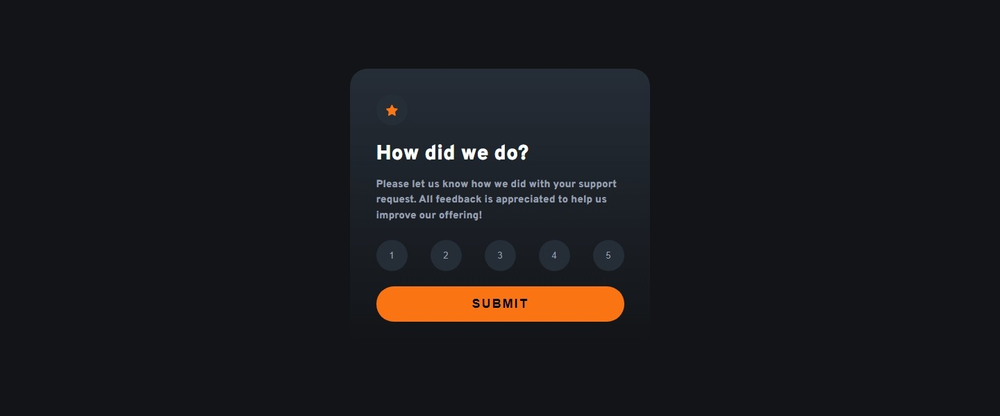
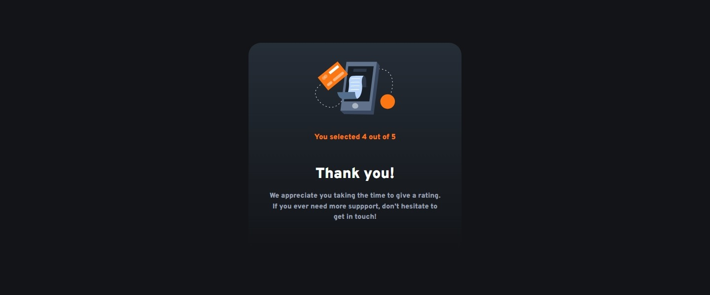
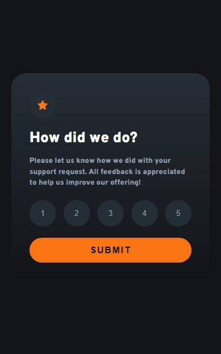

# Frontend Mentor - Interactive rating component solution

This is a solution to the [Interactive rating component challenge on Frontend Mentor](https://www.frontendmentor.io/challenges/interactive-rating-component-koxpeBUmI). Frontend Mentor challenges help you improve your coding skills by building realistic projects.

## Table of contents

- [Overview](#overview)
  - [The challenge](#the-challenge)
  - [Screenshot](#screenshot)
  - [Links](#links)
- [My process](#my-process)
  - [Built with](#built-with)
  - [What I learned](#what-i-learned)
  - [Continued development](#continued-development)
  - [Useful resources](#useful-resources)
- [Author](#author)
- [Acknowledgments](#acknowledgments)

## Overview

### The challenge

Users should be able to:

- View the optimal layout for the app depending on their device's screen size
- See hover states for all interactive elements on the page
- Select and submit a number rating
- See the "Thank you" card state after submitting a rating

### Screenshot





### Links

- Solution URL: [Solution on GitHub](https://github.com/horoserp/rating-component)
- Live Site URL: [Solution on Live Site](https://horoserp.github.io/rating-component)

## My process

### Built with

- HTML
- CSS (Flexbox)
- JavaScript

### What I learned

- More about different tab icons and how to include them in my sites.
- Lots about site.webmanifest including icons, screenshots for Richer Install UI, start_url, id
- The use of @media (hover:hover) to prevent hover from displaying on devices that don't support it.
- Continued implementation of :where() CSS Pseudo-Class

```js
sessionStorage.setItem("score", ratings[i].value);
```

```json
{
  "name": "Rating Component | REM",
  "short_name": "Robert's Site",
  "icons": [
    {
      "src": "https://horoserp.github.io/rating-component/assets/images/web-app-manifest-192x192.png",
      "sizes": "192x192",
      "type": "image/png",
      "purpose": "any"
    },
    {
      "src": "https://horoserp.github.io/rating-component/assets/images/web-app-manifest-512x512.png",
      "sizes": "512x512",
      "type": "image/png",
      "purpose": "any"
    }
  ],
  "screenshots": [
    {
      "src": "https://horoserp.github.io/rating-component/assets/images/rating-component-desktop.jpeg",
      "sizes": "1440x800",
      "type": "image/png",
      "form_factor": "wide",
      "label": "Desktop Rating Component"
    },
    {
      "src": "https://horoserp.github.io/rating-component/assets/images/rating-component-mobile.jpeg",
      "sizes": "375x667",
      "type": "image/png",
      "form_factor": "narrow",
      "label": "Mobile Rating Component"
    }
  ],
  "theme_color": "#ffffff",
  "background_color": "#ffffff",
  "display": "standalone"
}
```

### Continued development

I would like to learn how to properly declare a start_url in the site.webmanifest file. I explored a couple different options, but none of them fully suceeded.

I would like to continue practicing the use of the CSS :where() Pseudo-Class and the @media (hover:hover) query.

### Useful resources

- [W3Schools](https://www.w3schools.com/) - This is a great reference site which helped me remember some of the required syntax and generalities surrounding the base of a react project.
- [Stack Overflow](https://stackoverflow.com/) - This is an excellent resource for finding answers to precise questions. I used it once or twice during this challenge.

## Author

- Website - [Robert P. Horosewski](https://horoserp.github.io/React-Portfolio)
- Frontend Mentor - [@horoserp](https://www.frontendmentor.io/profile/horoserp)
- LinkedIn - [Robert P. Horosewski](https://www.linkedin.com/in/robert-horosewski-8a0608196/)

## Acknowledgments

Thanks to my wife for the encouragement to pursue my dream.
